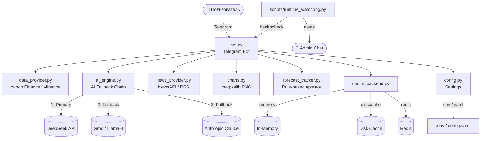

# Vanguard Bot


Telegram-бот для технического анализа финансовых тикеров (акции, крипта, форекс, сырьё) с rule-based прогнозом, AI-объяснениями и новостным контекстом.

> ⚠️ Бот не является финансовым советником. Используйте результаты в связке с собственным анализом и risk-management.

---

## Возможности

| Категория | Описание |
|---|---|
| **Теханализ** | SMA20/50, EMA200, RSI14, ATR14, ADX14, волатильность |
| **Прогноз** | Rule-based модель: вероятность роста/снижения, quality gate, D1/D2/D3 |
| **Intermarket** | Корреляции с `SPY` и `BTC-USD` |
| **AI-объяснения** | DeepSeek → Groq (Llama-3) → Anthropic Claude (fallback chain) |
| **Новости** | Sentiment-анализ: transformers с fallback на словарный анализ |
| **Кэш** | `memory` / `diskcache` / `redis` |
| **Графики** | PNG-чарт с SMA/EMA в Telegram |
| **UX** | Категории тикеров, пагинация, мультиязычность (ru/en) |
| **Безопасность** | Whitelist по Telegram ID, блокировка повторных инстанций |
| **Деплой** | Polling и Webhook, Docker Compose, Runtime Watchdog |
| **SaaS API** | REST API (FastAPI) с tier-based rate limiting, Stripe webhooks |

---

## Архитектура



---

## Быстрый старт

### Локально (polling)

```bash
git clone https://github.com/YOUR_USERNAME/vanguard_bot.git
cd vanguard_bot

python3.12 -m venv .venv
source .venv/bin/activate
pip install -r requirements.txt

cp .env.example .env
# Открыть .env и вписать TELEGRAM_BOT_TOKEN

python bot.py
```

### Production (Docker Compose + Webhook + Redis)

```bash
cp .env.example .env
# Вписать TELEGRAM_BOT_TOKEN, WEBHOOK_URL, ключи AI-провайдеров

docker compose -f docker-compose.prod.yml up -d --build
docker compose -f docker-compose.prod.yml ps
docker compose -f docker-compose.prod.yml logs -f bot
```

---

## Конфигурация

Все параметры задаются через `.env` (приоритет) или `config.yaml`.

| Переменная | По умолчанию | Описание |
|---|---|---|
| `TELEGRAM_BOT_TOKEN` | — | **Обязательно.** Токен от @BotFather |
| `DEEPSEEK_API_KEY` | — | API ключ DeepSeek (primary AI) |
| `GROQ_API_KEY` | — | API ключ Groq / Llama-3 (fallback) |
| `ANTHROPIC_API_KEY` | — | API ключ Claude (финальный fallback) |
| `AI_PROVIDER_TIMEOUT_SEC` | `22` | Таймаут на один AI-провайдер |
| `AI_TOTAL_BUDGET_SEC` | `24` | Суммарный бюджет AI-цепочки |
| `DEEPSEEK_STRICT` | `true` | Не переходит на fallback при выборе DeepSeek |
| `DEEPSEEK_FAST_PROMPT` | `true` | Короткий промпт → быстрый ответ |
| `DEEPSEEK_MAX_TOKENS` | `280` | Макс. токенов в ответе DeepSeek |
| `AUTH_WHITELIST` | — | Telegram ID через запятую. Пусто = открытый доступ |
| `CACHE_BACKEND` | `diskcache` | `memory` / `diskcache` / `redis` |
| `REDIS_URL` | `redis://redis:6379/0` | URL Redis (при `CACHE_BACKEND=redis`) |
| `USE_WEBHOOK` | `false` | Включить webhook-режим |
| `WEBHOOK_URL` | — | Публичный HTTPS-URL для webhook |
| `WATCHDOG_INTERVAL_SEC` | `180` | Интервал проверки watchdog (сек) |
| `ADMIN_CHAT_ID` | — | Telegram ID для watchdog-алертов |

Пример `config.yaml`:
```yaml
request_timeout_sec: 45
tickers_per_page: 10
market_cache_ttl_sec: 90
news_cache_ttl_sec: 120
cache_backend: diskcache
cache_dir: .cache
default_lang: ru
use_webhook: false
auth_whitelist: ""
```

---

## Команды бота

| Команда | Описание |
|---|---|
| `/start` | Главное меню |
| `/help` | Справка |
| `/reset` | Сбросить состояние |
| `/stats` | Статистика точности прогнозов |
| `/lang ru\|en` | Переключить язык |
| `/alert list` | Список активных алертов |
| `/alert add AAPL 5` | Добавить алерт (изменение ≥ 5%) |
| `/alert del AAPL` | Удалить алерт |

---

## Тесты

```bash
pip install -r requirements.txt

# Все тесты
pytest -q

# Smoke-check
bash scripts/smoke_test.sh
```

Структура тестов:
```
tests/
├── conftest.py
├── test_ai_engine.py          # AI fallback chain
├── test_api.py                # SaaS API (auth, keys, rate limiting, endpoints)
├── test_cache_backend.py      # Cache backends
├── test_data_provider.py      # yfinance data parsing
├── test_bot_smoke.py          # Bot startup smoke
└── test_deepseek_live.py      # Live DeepSeek (требует API-ключ)
```

---

## SaaS API

REST API для внешнего доступа к анализу тикеров. Документация: `http://localhost:8090/docs`

### Запуск

```bash
# Dev
uvicorn api.main:app --reload --host 0.0.0.0 --port 8090

# Production (Docker Compose)
docker compose -f docker-compose.prod.yml up -d
```

### Аутентификация

```
X-API-Key: vgd_your_api_key
```

### Тиры

| Тир | Цена | Запросов/день | Доступ |
|---|---|---|---|
| **free** | $0 | 10 | `/forecast/{ticker}` |
| **pro** | $29/мес | 200 | forecast + AI анализ + новости |
| **enterprise** | $149/мес | ∞ | всё + приоритет |

### Основные endpoints

| Метод | Endpoint | Тир | Описание |
|---|---|---|---|
| `GET` | `/api/v1/analyze/forecast/{ticker}` | все | Rule-based теханализ |
| `GET` | `/api/v1/analyze/{ticker}` | pro+ | Полный AI анализ |
| `GET` | `/api/v1/keys/me` | все | Инфо о своём ключе |
| `GET` | `/api/v1/keys/me/usage` | все | История запросов |
| `POST` | `/api/v1/keys` | admin | Создать ключ |
| `DELETE` | `/api/v1/keys/{id}` | admin | Деактивировать ключ |

### Первый ключ (bootstrap)

```bash
API_ADMIN_KEY=my-secret python3 scripts/create_api_key.py \
  --label "my-key" --email admin@example.com --tier pro
```

---

## Структура проекта

```
vanguard_bot/
├── bot.py                   # Точка входа, хендлеры Telegram
├── ai_engine.py             # AI fallback chain (DeepSeek → Groq → Claude)
├── data_provider.py         # Рыночные данные (yfinance)
├── news_provider.py         # Новости и sentiment-анализ
├── charts.py                # Генерация PNG-графиков
├── forecast_tracker.py      # Rule-based прогноз, трекинг точности
├── cache_backend.py         # Абстракция кэша (memory/disk/redis)
├── config.py                # Настройки (env + yaml)
├── i18n.py                  # Переводы (ru/en)
├── utils.py                 # Утилиты
├── logging_setup.py         # Логирование + Sentry DSN
├── backtesting.py           # Бэктест rule-based модели
├── api/                     # SaaS REST API (FastAPI)
│   ├── main.py              # FastAPI app, lifespan, middleware
│   ├── auth.py              # X-API-Key аутентификация, require_tier()
│   ├── database.py          # SQLAlchemy + SQLite/PostgreSQL
│   ├── models.py            # ApiKey, UsageLog, Tier enum
│   ├── rate_limiter.py      # Tier-based rate limiting
│   ├── schemas.py           # Pydantic схемы запросов/ответов
│   └── routes/
│       ├── analyze.py       # GET /forecast/{ticker}, GET /{ticker}
│       ├── keys.py          # CRUD управление ключами
│       └── webhook.py       # Stripe HMAC-SHA256 webhook
├── scripts/
│   ├── runtime_watchdog.py  # Watchdog: мониторинг + Telegram-алерты
│   ├── healthcheck.py       # Healthcheck для Docker
│   ├── create_api_key.py    # CLI bootstrap первого API-ключа
│   └── smoke_test.sh        # Smoke-тест окружения
├── tests/                   # Pytest тесты (13 bot + 23 API)
├── docker-compose.prod.yml  # Production стек (bot + api + redis + watchdog)
├── Dockerfile
├── requirements.txt         # Dev-зависимости (включая torch, pytest)
├── requirements.runtime.txt # Production-зависимости (облегчённые)
├── config.yaml.example
└── .env.example
```

---

## Про производительность Docker-сборки

Production-образ использует `requirements.runtime.txt` — без `torch`, `transformers`, `pytest`.
Это сокращает размер образа и ускоряет сборку.

---

## Лицензия

MIT License
